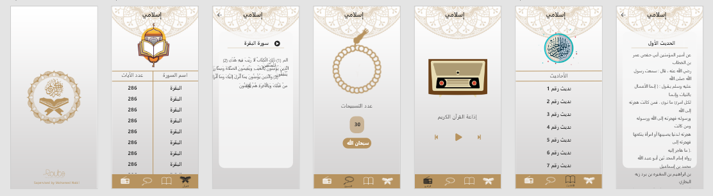

# Islami_App

A Flutter application developed to provide a comprehensive Islamic experience, focusing on elegant UI design and enhanced user experience in a religious context.

## Overview

- Developed an Islamic app using Flutter, showcasing strong Flutter development skills.
- Efficient data management implemented using Provider state management.
- English and Arabic localization incorporated for a broader user base.
- Light and dark themes available for user preference.
  

## Features

The app offers the following features:

1. **Hadiths**: Access a collection of Hadiths for spiritual guidance.
2. **Radio**: Listen to Islamic radio for religious content and sermons.
3. **Sebha**: Use a digital Tasbeeh for counting prayers.
4. **Quran (Moshaf)**: Read and explore the Quran through the Moshaf feature.

## Getting Started

This project is a Flutter application. If this is your first Flutter project, you can get started with the following resources:

- [Lab: Write your first Flutter app](https://docs.flutter.dev/get-started/codelab)
- [Cookbook: Useful Flutter samples](https://docs.flutter.dev/cookbook)

For detailed Flutter development guidance, refer to the [online documentation](https://docs.flutter.dev/), which offers tutorials, samples, and a full API reference.

## Screenshots

Include screenshots of key features or UI elements to provide a visual representation of your app.
